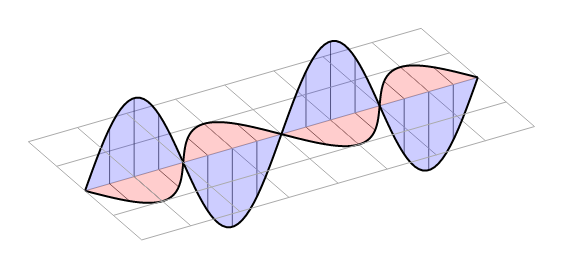

# CeTZ

CeTZ (CeTZ, ein Typst Zeichenpaket) is a library for drawing with [Typst](https://typst.app) with an API inspired by TikZ and [Processing](https://processing.org/).

## Examples
<!-- img width is set so the table gets evenly spaced by GitHubs css -->
<table><tr>
  <td>
    <a href="gallery/karls-picture.typ">
      
    </a>
  </td>
  <td>
    <a href="gallery/tree.typ">
      
    </a>
  </td>
  <td>
    <a href="gallery/waves.typ">
      
    </a>
  </td>
</tr><tr>
  <td>Karl's Picture</td>
  <td>Tree Layout</td>
  <td>Waves</td>
</tr>
</table>

*Click on the example image to jump to the code.*

## Usage

For information, see the [online manual](https://cetz-package.github.io/docs).

To use this package, simply add the following code to your document:
```
#import "@preview/cetz:0.3.0"

#cetz.canvas({
  import cetz.draw: *
  // Your drawing code goes here
})
```

## CeTZ Libraries

- [cetz-plot - Plotting and Charts Library](https://github.com/cetz-package/cetz-plot)
- [cetz-venn - Simple two- or three-set Venn diagrams](https://github.com/cetz-package/cetz-venn)

## Installing

To install the CeTZ package under [your local typst package dir](https://github.com/typst/packages?tab=readme-ov-file#local-packages) you can use the `install` script from the repository.

```bash
just install
```

The installed version can be imported by prefixing the package name with `@local`.

```typ
#import "@local/cetz:0.3.0"

#cetz.canvas({
  import cetz.draw: *
  // Your drawing code goes here
})
```

### Just

This project uses [just](https://github.com/casey/just), a handy command runner.

You can run all commands without having `just` installed, just have a look into the `justfile`.
To install `just` on your system, use your systems package manager. On Windows, [Cargo](https://doc.rust-lang.org/cargo/) (`cargo install just`), [Chocolatey](https://chocolatey.org/) (`choco install just`) and [some other sources](https://just.systems/man/en/chapter_4.html) can be used. You need to run it from a `sh` compatible shell on Windows (e.g git-bash).

## Testing

This package comes with some unit tests under the `tests` directory.
To run all tests you can run the `just test` target. You need to have
[`typst-test`](https://github.com/tingerrr/typst-test/) in your `PATH`: `cargo install typst-test --git https://github.com/tingerrr/typst-test`.

## Projects using CeTZ
- [cirCeTZ](https://github.com/fenjalien/cirCeTZ) A port of [circuitikz](https://github.com/circuitikz/circuitikz) to Typst.
- [conchord](https://github.com/sitandr/conchord) Package for writing lyrics with chords that generates fretboard diagrams using CeTZ.
- [finite](https://github.com/jneug/typst-finite) Finite is a Typst package for rendering finite automata.
- [fletcher](https://github.com/Jollywatt/typst-fletcher) Package for drawing commutative diagrams and figures with arrows.
- [riesketcher](https://github.com/ThatOneCalculator/riesketcher) Package for drawing Riemann sums.
