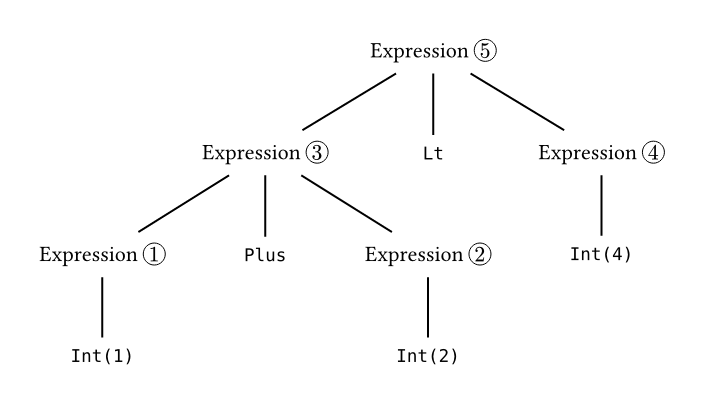

# CeTZ

CeTZ (CeTZ, ein Typst Zeichenpacket) is a library for drawing with [Typst](https://typst.app) with an API inspired by TikZ and [Processing](https://processing.org/).

## Examples
<!-- img width is set so the table gets evenly spaced by GitHubs css -->
<table><tr>
  <td>
    <a href="gallery/karls-picture.typ">
      
    </a>
  </td>
  <td>
    <a href="gallery/tree.typ">
      
    </a>
  </td>
  <td>
    <a href="gallery/3d-chart.typ">
      
    </a>
  </td>
</tr><tr>
  <td>Karl's Picture</td>
  <td>Tree Layout</td>
  <td>3D Chart</td>
</tr><tr>
  <td>
    <a href="gallery/pie-chart.typ">
      
    </a>
  </td>
  <td>
    <a href="gallery/plot.typ">
      
    </a>
  </td>
  <td>
    <a href="gallery/barchart.typ">
      
    </a>
  </td>
</tr><tr>
  <td>Pie Chart</td>
  <td>Plot</td>
  <td>Clustered Barchart</td>
</tr>

</table>

*Click on the example image to jump to the code.*

## Usage

For information, see the [manual](manual.pdf?raw=true).

To use this package, simply add the following code to your document:
```
#import "@preview/cetz:0.0.1"

#cetz.canvas({
  import cetz.draw: *
  // Your drawing code goes here
})
```

## Installing

To install the CeTZ package under your local typst package dir you can use the `install` script from the repository.

```bash
just install
```

The installed version can be imported by prefixing the package name with `@local`.

```typ
#import "@local/cetz:0.0.1"

#cetz.canvas({
  import cetz.draw: *
  // Your drawing code goes here
})
```

### Just

This project uses [just](https://github.com/casey/just), a handy command runner.

You can run all commands without having `just` installed, just have a look into the `justfile`.
To install `just` on your system, use your systems package manager. On Windows, [Cargo](https://doc.rust-lang.org/cargo/) (`cargo install just`), [Chocolatey](https://chocolatey.org/) (`choco install just`) and [some other sources](https://just.systems/man/en/chapter_4.html) can be used. You need to run it from a `sh` compatible shell on Windows (e.g git-bash).

## Testing

This package comes with some unit tests under the `tests` directory.
To run all tests you can run the `just test` target.

You need to have ImageMagick installed on your system, which is needed for image comparison.

### Windows
If you are using the [Chocolatey](https://chocolatey.org/) package manager, you can install imagemagick using `choco install imagemagick`.
Otherwise download and install a matching package from the [ImageMagick](https://imagemagick.org/script/download.php) website.

## Projects using CeTZ
- [circuitypst](https://github.com/fenjalien/circuitypst) A port of [circuitikz](https://github.com/circuitikz/circuitikz) to Typst
- [typst-chords](https://github.com/ljgago/typst-chords) A library to write song lyrics with chord diagrams in Typst
